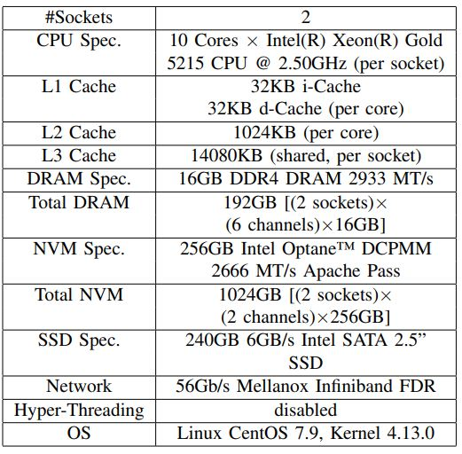
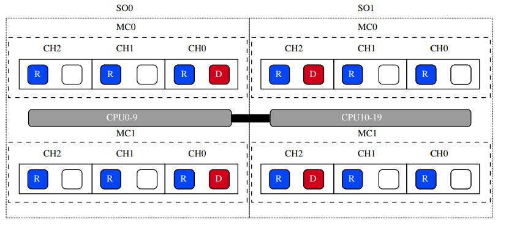

# Assessing the Use Cases of Persistent Memory in High-Performance Scientific Computing
As the High Performance Computing (HPC) world moves towards the Exa-Scale era, huge amounts of data should be analyzed, manipulated and stored. In  the traditional storage/memory hierarchy, each compute node retains its data objects in its local volatile DRAM. Whenever the DRAM’s capacity becomes insufficient for storing this data, the computation should either be distributed between several compute nodes, or some portion of these data  objects must be stored in a non-volatile block device such as a hard disk drive (HDD) or an SSD storage device. These standard block devices offer  large and relatively cheap non-volatile storage, but their access times are orders-of-magnitude slower than those of DRAM. Optane™  Data Center Persistent Memory Module (DCPMM), a new technology introduced by Intel, provides non-volatile memory that can be plugged into standard memory bus  slots (DDR DIMMs) and therefore be accessed much faster than standard storage devices. In this work, we present and analyze the results of a comprehensive performance assessment of several ways in which DCPMM can 1) replace standard storage devices, and 2) replace or augment DRAM for  improving the performance of HPC scientific computations. To achieve this goal, we have configured an HPC system such that DCPMM can service I/O operations of scientific applications, replace standard storage devices and filesystems (specifically for diagnostics and checkpoint-restarting), and  serve for expanding applications’ main memory. We focus on keeping the scientific codes with as few changes as possible, while allowing them to access the NVM transparently as if they access persistent storage. Our results show that DCPMM allows scientific applications to fully utilize nodes’ locality by providing them with sufficiently-large main memory. Moreover, it can also be used for providing a high-performance replacementfor persistent storage. Thus, the usage of DCPMM has the potential of replacing standard HDD and SSD storage devices in HPC architectures and enabling a more efficient platform for modern super computing applications. 

**This repository contains experimental results and some codes and scripts used in this work.** 
## Scientific Computing Benchmarks
In this work we focus on scientific benchmarks that are often used for evaluating the performance of parallel supercomputers. We experiment with representative memory and storage usage scenarios scientific applications that run on HPC systems, in order to assess the extent to which NVM can increase productivity for scientific computing.

### Nas Parallel Benchmarks (NPB)
The NAS Parallel Benchmarks (NPB) are a small set of programs designed to help evaluate the performance of parallel supercomputers. The benchmarks are derived from computational fluid dynamics (CFD) applications and consist of five kernels and three pseudo-applications in the original "pencil-and-paper" specification (NPB 1). The benchmark suite has been extended to include new benchmarks for unstructured adaptive meshes, parallel I/O, multi-zone applications, and computational grids. Problem sizes in NPB are predefined and indicated as different classes. Reference implementations of NPB are available in commonly-used programming models like MPI and OpenMP (NPB 2 and NPB 3). \
The NPB suite can be found [here](https://www.nas.nasa.gov/software/npb.html).

### PnetCDF I/O Benchmark using BTIO Pattern
Specifically, the BTIO benchmark can be found [here](https://github.com/wkliao/BTIO). \
This software benchmarks the performance of PnetCDF and MPI-IO methods for the I/O pattern used by the NASA's NAS Parallel Benchmarks (NPB) suite.

### PolyBench Benchmarks
PolyBench is a collection of benchmarks containing static control parts. The purpose is to uniformize the execution and monitoring of kernels, typically used in past and current publications. \
The PolyBench suite can be found [here](https://web.cse.ohio-state.edu/~pouchet.2/software/polybench).

## Experimental System Specifications and DCPMM Population
Our experimental environment consists of a dual-socket server. The DCPMM population configuration is 2-1-1. 
When using NVM as a node’s memory expansion, we applied the Optane™ DCPMM Memory mode, 
while in the rest of the work, we applied the App Direct mode. 

 
